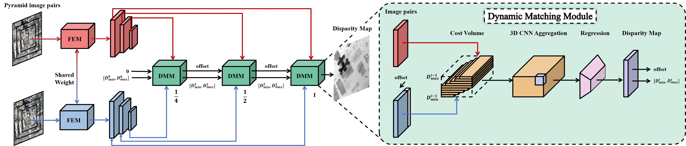

# HDM-Stereo


# Environment
- NVIDIA RTX 3090
- Python 3.10.13
- CUDA 12.3

# Conda Environment
```bash
conda env create -f resources/environment.yml
conda activate HDM
```

# Required Data

- [US3D](https://ieee-dataport.org/open-access/data-fusion-contest-2019-dfc2019)
  - Track 2 / Training data / RGB images 1/4 Train-Track2-RGB-1.zip
  - Track 2 / Training data / RGB images 2/4 Train-Track2-RGB-2.zip
  - Track 2 / Training data / RGB images 3/4 Train-Track2-RGB-3.zip
  - Track 2 / Training data / RGB images 4/4 Train-Track2-RGB-4.zip
  - Track 2 / Training data / Reference Train-Track2-Truth.zip
- [WHU-Stereo](https://github.com/Sheng029/WHU-Stereo/tree/master)
- [WHU-MVS](http://gpcv.whu.edu.cn/data/)

The downloaded dataset is recommended to be placed in the 'data' folder.

The downloaded dataset should be organized into directories with the following structure, ensuring that the corresponding files in the left, right, and disp folders have identical filenames.

```text
data
├─US3D
│  ├─train
│  │  ├─disp
│  │  ├─left
│  │  └─right
│  └─val
│      ├─disp
│      ├─left
│      └─right
├─WHU-MVS
│  ├─train
│  │  ├─disp
│  │  ├─left
│  │  └─right
│  └─val
│      ├─disp
│      ├─left
│      └─right
└─WHU-Stereo
    ├─train
    │  ├─disp
    │  ├─left
    │  └─right
    └─val
        ├─disp
        ├─left
        └─right
```

# Training
- Training Command Template: `<method> train.py <params>`
  - `<method>`(3 GPUs)
    - Single-card training: `python`
    - Multi-card training: `CUDA_VISIBLE_DEVICES=0,1,2 python`
    - [Distributed training](https://pytorch.org/docs/stable/elastic/run.html): `OMP_NUM_THREADS=1 torchrun --standalone --nnodes=1 --nproc-per-node=3`
  - `<params>`(dataset=US3D, model=hmsm, batch_size=4)
    - Training without data augmentation
      ```bash
      -ws -b 4 -m hmsm -ds US3D
      ```
    - Training with data augmentation
      ```bash
      -wsa -b 4 -m hmsm -ds US3D
      ```
    - Training with a larger pre-defined disparity range (e.g., 192)
      ```bash
      -wsa -b 4 -m hmsm -ds US3D params --min-disp -192 --max-disp 192
      ```
    - Distributed training requires adding the `-d` flag.
    - If you change the dataset location, please specify it using the `-p`.
    - If wandb tracking is not needed, you can remove `-w`
- Modify the range and probability of random translation: `Tool/data_reader.py:41`
  ```python
  from random import randint, random
  if random() < 0.7:
    offset = randint(-100, 100)
  ```
# Evaluation
- You can use the [pre-trained model](https://pan.baidu.com/s/1_Upkolf7CYqSlZpbujvGkw?pwd=z8jx) to directly reproduce the results presented in this paper.
- Evaluate the `<checkpoint_path>` on the `<dataset>`
  ```bash
  python eval.py -c <checkpoint_path> -d <dataset>
  ```
- Evaluate the `<checkpoint_path>` optimized by HDM-Stereo on the `<dataset>`
  ```bash
  python eval.py -o -c <checkpoint_path> -d <dataset>
  ```
- Perform ablation studies on <model> using the <dataset>
  ```bash
  python eval_ablation.py -m <model> -d <dataset>
  ```
